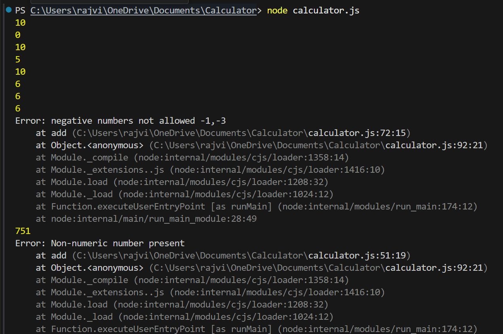
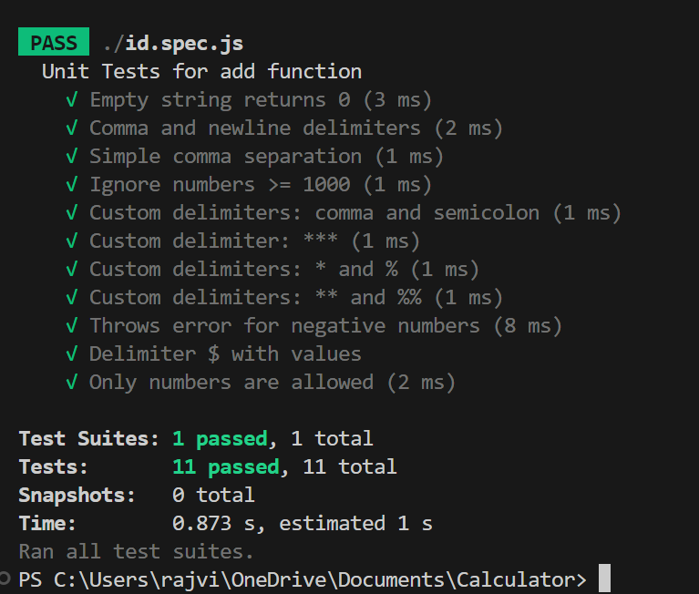

# Calculator

# 🧮 Simple Node.js Calculator – Addition with Unit Testing

Welcome to a simple Node.js calculator project that performs **addition** and includes **unit tests** using Jest.
This is perfect for learning how to build and test small logic-based functions in JavaScript.

---

## 📝 Input

string containg numbers to be added separated by delimiters(Eg:",",";",etc.)

## 📤 Output

summation of whole numbers present in string

## 🚀 Features

- ✅ Add multiple numbers present in a string
- ✅ Handles custom and multiple delimiters
- ✅ Handles edge cases like no input
- ✅ Fully tested with Jest
- ✅ Simple and clean file structure
- ✅ Runs directly from the command line

---

## 📂 Project Structure

```
calculator/
├── src/
│ └── calculator.js # ➕ Addition logic
├── test/
│ └── calculator.test.js # 🧪 Unit tests using Jest
├── package.json # 📦 Project metadata & scripts
└── README.md # 📘 Documentation
```

---

## ⚙️ Requirements

- Node.js installed (v12+ recommended)
- npm (comes with Node)

---

## 🔎 About Jest

⚙️ Zero Setup – Works out of the box, no config needed
⚡ Fast Execution – Runs tests in parallel for better speed
🧪 Built-in Mocks – Easily mock functions, modules, and timers
📸 Snapshot Testing – Detect unintended changes in UI or output
📊 Code Coverage – Get detailed reports with --coverage

---

## ▶️ Run Calculator

node src/calculator.js

Ouptut:


---

## 🧪 Run test Cases

npm run test

-testCase outptut


## 📦 Installation

- Clone the project and install dependencies:

```bash
git clone https://github.com/rajviCE/calculator.git
cd calculator
npm install
```

---

## 🛠️ TechStack

-Javascript (ES6)
-Jest(Javascript testing framework)

---

## 🗒️ Notes

-input string must containers numbers separated via delimiters (Eg:"1,2,3,4")
-Multiple delimiters are valid (Eg:[\*][%]\n1\*2%3")
-newline is an inplicit delimiter
-Only numeric values less than 1000 are summed
-Negative numbers, and alphabets are not allowed. THey throw error.

---
